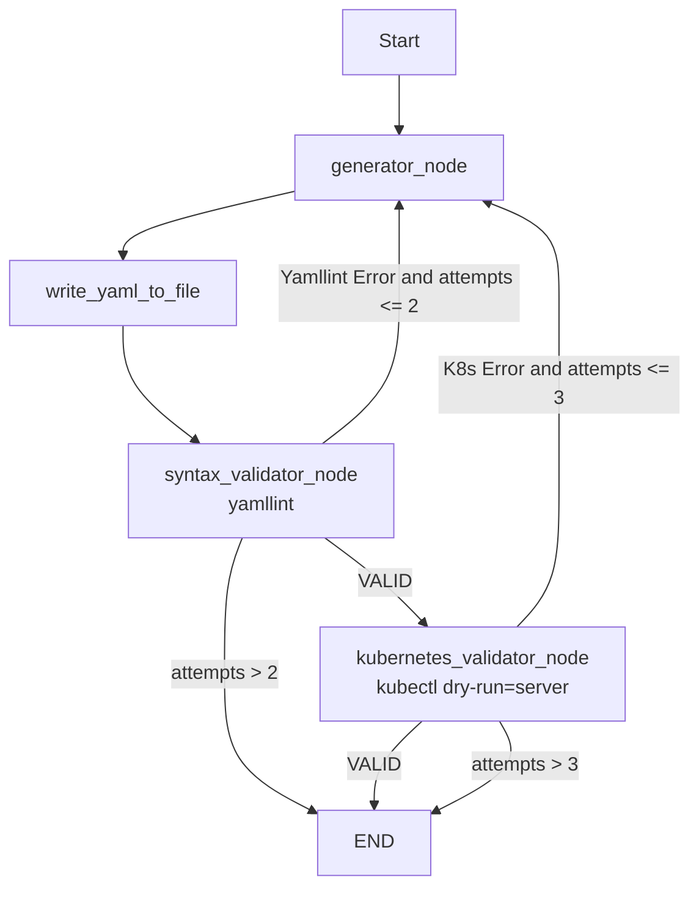

# LLM Agent for Kubernetes configurations

Repository to generate and validate Kubernetes YAML configurations using a LangGraph-based agent and an LLM served through LiteLLM/Ollama.

## Goal

Given a natural language task, the agent:
1. generates Kubernetes YAML Manifest,
2. validates syntax with `yamllint`,
3. validates Kubernetes correctness using `minikube`,
4. regenerates YAML with feedback when errors are found.

## Repository Structure

### Root

- `agent_test.py`: main script with agent state definition, LangGraph nodes, and loop/stop logic.
- `utils.py`: helper functions.
- `requirements.txt`: Python dependencies for the project.


### configuration_examples/

Contains a collection of Kubernetes examples covering multiple scenarios. Each scenario is built with a specific resource configuration to test the agent across setups that progress from simple to increasingly complex.

### results/

Contains YAML files generated by the agent at each attempt to study and track its behavior over time.

## Agent Logic

### Agent State

The shared state (`AgentState`) includes:

- `task`: user request.
- `generated_yaml`: YAML generated by the LLM.
- `yaml_path`: file path of the YAML written to disk.
- `feedback`: outcome or error from the latest validation.
- `attempts`: number of attempts.

### Flow



## Requirements

- Python 3.10+
- `yamllint` available in the Python environment
- `kubectl` installed and configured against a reachable cluster using `minikube` 
- Ollama running locally with the model configured in `agent_test.py`

## Quick Start

```bash
python -m venv .venv
.venv\\Scripts\\activate
pip install -r requirements.txt
python agent_test.py
```
