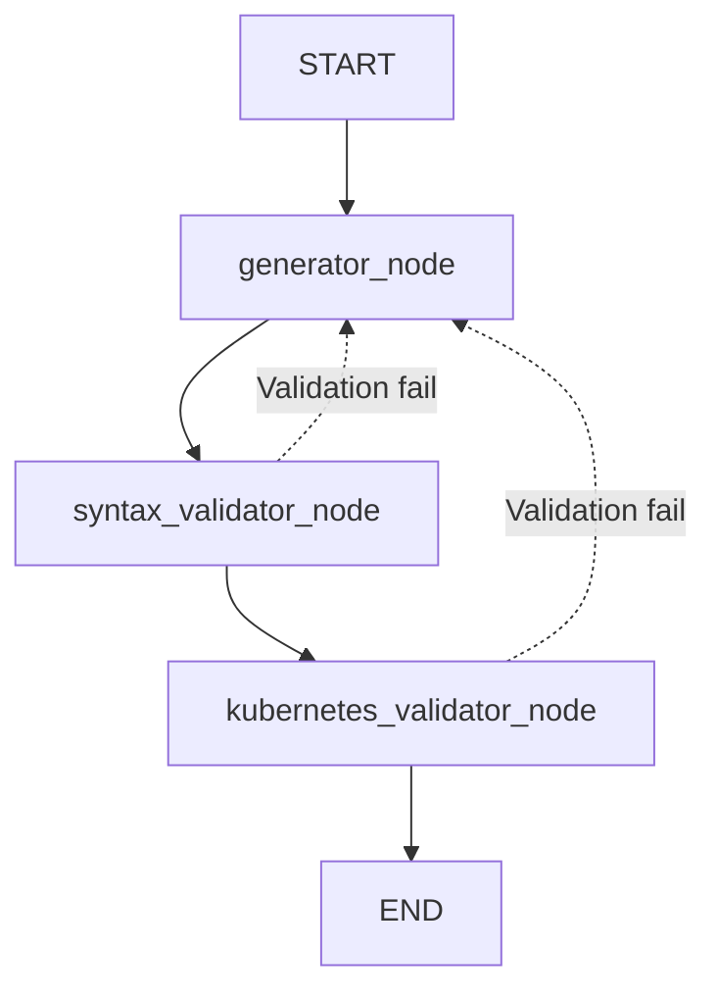

# LLM Agent for Kubernetes configurations

Repository to generate and validate Kubernetes YAML configurations using a LangGraph-based agent and an LLM served through LiteLLM/Ollama.

## Goal

Given a natural language task, the agent:
1. generates Kubernetes YAML Manifest,
2. validates syntax with `yamllint`,
3. validates Kubernetes correctness using `minikube`,
4. regenerates YAML with feedback when errors are found.

## Repository Structure

### Root

- `agent_test.py`: main script with agent state definition, LangGraph nodes, and loop/stop logic.
- `utils.py`: helper functions.
- `requirements.txt`: Python dependencies for the project.


### configuration_examples/

Contains a collection of Kubernetes examples covering multiple scenarios. Each scenario is built with a specific resource configuration to test the agent across setups that progress from simple to increasingly complex.

### results/

Contains YAML files generated by the agent at each attempt to study and track its behavior over time.

## Agent Logic

### Agent State

The shared state (`AgentState`) includes:

- `task`: user request.
- `generated_yaml`: YAML generated by the LLM.
- `yaml_path`: file path of the YAML written to disk.
- `feedback`: outcome or error from the latest validation.
- `attempts`: number of attempts.

### Flow



### Nodes 
- `generator_node`: Invokes the LLM using the user’s prompt, waits for the model’s response, and writes the generated YAML file that will be used in the subsequent validation steps. When validation errors occur, they are appended to the prompt so the model can refine the output in the next iteration.
- `syntax_validation_node`: Uses `yamllint` to check the syntactic correctness of the generated YAML file. If no issues are found, execution proceeds to the next node; otherwise, the process returns to the generator node, adding the linting errors to the prompt.
- `kubernetes_validator_node`: Runs `kubectl --dry-run= server` to validate the functional correctness of the configuration against a live `Minikube` cluster. If the configuration passes, the agent’s execution ends. If errors are detected, the process returns to the generator node, including the validation output in the prompt.

## Requirements

- Python 3.10+
- `yamllint` available in the Python environment
- `kubectl` installed and configured against a reachable cluster using `minikube` 
- Ollama running locally with the model configured in `agent_test.py`

## Quick Start

```bash
python -m venv .venv
.venv\\Scripts\\activate
pip install -r requirements.txt
python agent_test.py
```
