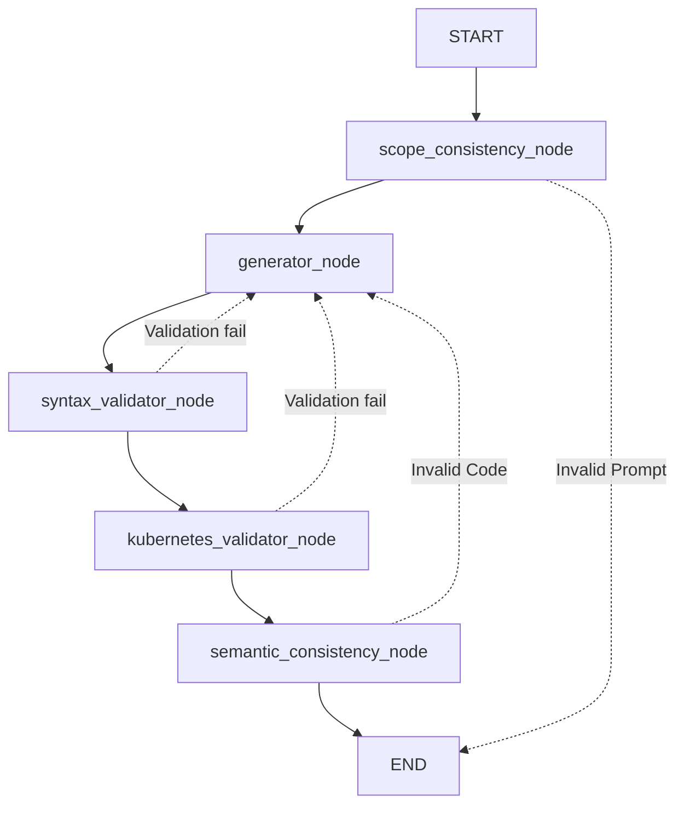

# LLM Agent for Kubernetes configurations

Repository to generate and validate Kubernetes YAML configurations using a LangGraph-based agent and an LLM served through LiteLLM/Ollama.

## Goal

Given a natural language task, the agent:
1. Check the prompt consistency based on the role of the agent, blocking malicious or not related requests,
2. Generates Kubernetes YAML Manifest,
3. Validates syntax with `yamllint`,
4. Validates Kubernetes correctness using `minikube`,
5. Check that the generated code satisfies what the user requested,
6. Regenerates YAML with feedback when errors are found.

## Repository Structure

### Root

- `requirements.txt`: python dependencies for the project.
- `yamllint_config.yaml`: YAML file containing the configuration of `yamllint` used in the agent.
- `prompts.yaml`: YAML file containing the prompts used by the agent, optimized for several different models.

### src/

Contains the application source code of the agent:
- `agent.py`: main script with agent state definition, LangGraph nodes, and loop logic.
- `utils.py`: helper functions.
- `main.py`: contains a FastAPI application that expose enpoints to connect to the agent.

### configuration_examples/

Contains a collection of Kubernetes examples covering multiple scenarios. Each scenario is built with a specific resource configuration to test the agent across setups that progress from simple to increasingly complex. 

The folder also contains text files generated by the models from the YAML examples. These files describe the configuration intent in natural language and can be used as reverse input for the agent after.

### results/

Contains YAML files generated by the agent at each attempt to study and track its behavior over time.

## Agent Logic

### Agent State

The shared state (`AgentState`) includes:

- `task`: user request.
- `model_name`: llm model name used in the current execution.
- `generated_yaml`: YAML generated by the LLM.
- `yaml_path`: file path of the YAML written to disk.
- `feedback`: outcome or error from the latest validation.
- `attempts`: number of attempts.
- `consistency`: outcome from the consistency checks.

### Flow



### Nodes 
- `scope_consistency_node`:Validates that the user's request is within the scope of the agent and blocks malicious or unrelated prompts invoking a LLM. If the prompt is invalid, the execution terminates immediately.
- `generator_node`: Invokes the LLM using the user’s prompt, waits for the model’s response, and writes the generated YAML file that will be used in the subsequent validation steps. When validation errors occur, they are appended to the prompt so the model can refine the output in the next iteration.
- `syntax_validation_node`: Uses `yamllint` to check the syntactic correctness of the generated YAML file. If no issues are found, execution proceeds to the next node; otherwise, the process returns to the generator node, adding the linting errors to the prompt.
- `kubernetes_validator_node`: Runs `kubectl --dry-run= server` to validate the functional correctness of the configuration against a live `Minikube` cluster. If the configuration passes, the agent’s execution ends. If errors are detected, the process returns to the generator node, including the validation output in the prompt.
- `semantic_consistency_node`: Validates semantic consistency between the user's requested intent and the generated Kubernetes YAML manifest. If the generated YAML does not match the requirements, execution returns to the generator node for refinement.

## Requirements

Basic tools required:
- `Python 3.10+`
- `yamllint` available in the Python environment
- `kubectl` installed and configured against a reachable cluster using `minikube` 
- `Ollama` running locally with the model configured in `agent_test.py`

## Quick Start

```bash
python -m venv .venv
.venv\\Scripts\\activate
pip install -r requirements.txt
python agent_test.py
```
